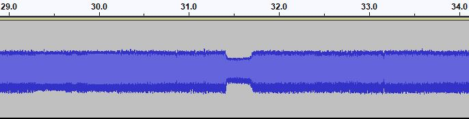
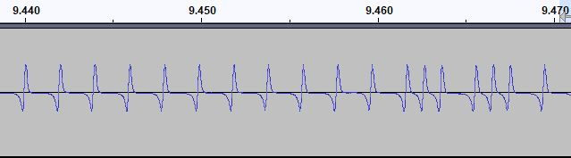
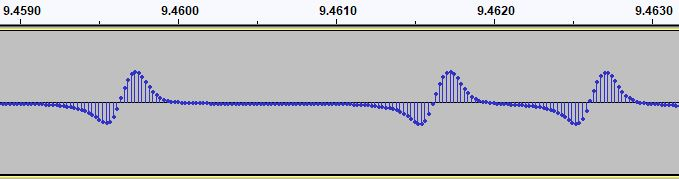
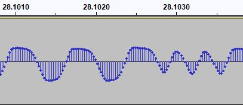

# TRS-80_TC-8 Theory Folder

## Background

Cassette tapes were chosen as a recording medium in the late 1970s because of how common and inexpensive they
had become by then - NOT because of their fidelity or recording quality.

### Considerations when using cassettes:

Any medium for recording required consideration of the nature of analog cassette recording, especially on
the type of devices employed for this purpose.  The following are a few of those considerations:

**Frequency Response**: While cassettes were beginning to become HiFi/stereo equipment around this time,
the units they chose for computers were portable low-cost units with much lower fidelity. And people were
interested in buying the least expensive casssettes that would work. Assume, for minimum standards, a
slightly better frequency response than AM radio: perhaps 40Hz-10,000Hz.

**Volume**: Since recording may be made at different levels, and there is no objective way to observe/measure
signal output from the cassette player, the input to the system should be able to properly read a signal from
a wide range of output levels.  *This is a major failing of the original TRS-80 Model I circuitry, as it was
notoriously sensitive to volume levels*.

**Dropouts**: Inconsistent application of the ferric oxide particles often caused volume level variations
during playback. Here is a real example of one, excountered on a cassette I was making a WAV file of:

**Motor Speed**: While cassettes players were intended to run at the same, consistent speed as other
recorders/players, it was possible for the speed to vary by a few percent, especially on the low-cost
portable versions which were employed with computers. So any recording format should be able to deal
with a +/-5% variance in pitch/speed.

**Polarity**: It may be possible that a recording deck and a playback deck may not represent the signal with
the same polarity, so the signal should be readable whether written in the same orientation as written, or
whether inverted.

**Background Noise**: There is noise in all analog electronics, and clearly the signal needs to be larger
than the noise. Maximizing this signal-to-noise ratio can depend on the type of signal being saved, as well
as recording and playback levels.

**60Hz Line Hum**: As the tape recorder is expected to always be available, these were generally powered by
line current, with an internal AC-to-DC power supply. Some supplies are better than others, and sometimes
the 60Hz ripple from the power supply can be heard as a faint source of background noise. Radio Shack's
"TRS-80 Micro Computer Technical Reference Handbook" seemed to indicate that Radio Shack was very concerned
that the volume level of this 60Hz hum would be a major influence in the audio signal and therefore a major
worry (however, I didn't find this to be so severe).

**Internal Noise Sources**: Cassette recorders have additional internal sources of noise, such as the motor
noise, and vibrations caused by moving parts. Again, these aren't major factors, but are considerations to
be taken into account.

## Tape Formats

### TRS-80 Native Format

Of course, every file can be decomposed into bytes, and bytes need to be serialized into a series of bits.
The most basic format of storage on cassettes must be a bit, and from there, a more comprehensive protocol
must be constructed.

#### TRS-80 Native Format - Bit-Level Encoding

At the lowest level, the TRS-80 Model 1 wrote bits to tape using pulses. The pulses formed a timebase,
with a separation of 2 milliseconds as a "clock" of sorts; the presence of an additional pulse midway between two
clock pulses (roughly at the 1ms mark) indicated a '1' bit, and the abscence of that additional pulse
indicated a '0' bit.  This 2 millisecond 'clock' is how the "500 baud" speed is derived.

The following image shows the timebase, and two '1' bits toward the right edge - notice how the waveform
no longer appears to be a squarewave, due to the limited frequency response of the medium:

The pulses include both a descending and an ascending pulse (below and above the midway line), fulfilling
the polarity requirement. Based on ROM disassemblies, these pulses are each approximately 450 microseconds
wide. The delay between clock pulses is roughly 2 milliseconds, or 1 millisecond in the case of the '1' bit
between clocks.

On playback, the clock pulses need to exceed a threshold voltage, in order to trigger a flip-flop to hold
that value until deliberately reset. This flip-flop threshold voltage is almost certainly the reason for
the over-sensitivity of the TRS-80 to volume levels.

The program which reads these pulses:
1. Checks for the flip-flop value to have been triggered (or wait until it is triggered)
2. Resets the flip-flop, waits roughly 1 millisecond (by counting machine cycles), and checks the flip-flop again (midway between clock pulses), to determine whether this is a '0' or '1' bit
3. Resets the flip-flop once again and waits for the remainder of the cycle, to synchronize with the next clock pulse

#### TRS-80 Native Format - Assembling Bits into Bytes

In order to assemble bits into bytes, two things must happen:
1. Synchronization of bits at the byte boundary, and
2. Agreement of bit sequence

In order to synchronize, the start of a file begins with a series of 256 zeroes, followed by a 0xA5 byte.
The bit sequence for TRS-80 format is most-significant bit first, so the bits for the 0xA5 byte are written
in the sequence: 10100101 .  It is significant that the first bit of this sync byte is non-zero.

#### TRS-80 Native Format - Overall Tape Protocol

From here, files for BASIC or machine-language data/programs have different formats:

**BASIC DATA FILES**

| Bytes | Usage | Description |
|-------|-------|-------------|
| -- | Lead-In | The lead-in consists of 256 iterations of '0' bits. This is followed by the sync byte |
| 01 | Sync Byte | The lead-in is followed by a sync byte of 0xA5 ('Byte 01') |
| 02- | Data Bytes | BASIC Data Files are structured in whatever way the user's program requires |

**BASIC PROGRAMS**

| Bytes | Usage | Description |
|-------|-------|-------------|
| -- | Lead-In | The lead-in consists of 256 iterations of '0' bits. This is followed by the sync byte. |
| 01 | Sync Byte | The lead-in is followed by a sync byte of 0xA5 ('Byte 01'). |
| 02-04 | Header | The BASIC Header is 3 bytes of value 0xD3. |
| 05 | Filename | The BASIC Program Name consists of only one letter. |
| 06-EOF | Program | The BASIC Program is stored as a linked list of null-terminated strings of BASIC tokens and text. |
| EOF | EOF Marker | The end of the BASIC program is marked by 3 0x00 bytes. |

**MACHINE-LANGUAGE PROGRAMS**

| Bytes | Usage | Description |
|-------|-------|-------------|
| -- | Lead-In | The lead-in consists of 256 iterations of '0' bits. This is followed by the sync byte. |
| 01 | Sync Byte | The lead-in is followed by a sync byte of 0xA5 ('Byte 01'). |
| 02 | File Type | The file type for a machine-language program is 0x55. |
| 03-08 | Filename | The filename for the file on tape can be up to 6 characters in length, stored in ASCII, and with trailing spaces if the name is shorted than 6 characters. |
| 09-?? | DATABLOCK | There can be one or more datablocks in the file (minimum one). |
| |  **DATABLOCK FORMAT**: | |
| 01 | Block Type | This is 0x3C for binary data |
| 02 | No. of Bytes | Number of bytes in block. '0x00' implies 256; other values are as stated (i.e. 0x05 = 5) |
| 03-04 | Load Address | This is where the data is to be loaded, least-significant byte first. (i.e. 0x00 0x4B = 0x4B00). Blocks do not need to be contiguous, but generally are continguous. |
| 05-nn | Data | Data bytes to load |
| EOB | Checksum value to validate whether data loaded was correct |
| | **END OF FILE BLOCK**: | |
| 01 | Block type | This is 0x78 to indicate transfer address. |
| 02-03 | Transfer Address | This is where execution is to start, least-significant byte first. (i.e. 0x00 0x4B = 0x4B00). |

### TC-8 Format

As stated above, every file can be decomposed into bytes, and bytes need to be serialized into a series of bits.
The most basic format of storage on cassettes must be a bit, and from there, a more comprehensive protocol
must be constructed.

#### TC-8 Format - Bit-Level Encoding

At the lowest level, the TC-8 writes bits to tape with half-waves.

The TC-8 hardware adds a zero-crossing comparator, and checks for the timing of waveform zero-crossing, instead
of hitting a volume threshold. Zero-crossing is MUCH less sensitive to absolute volume levels, and also works
with either polarity, since zero-crossing from positive to negative is treated the same as zero-crossing from
negative to positive.

* A '0' is represented by a 'long' halfwave (either positive or negative) of roughly 370 microseconds.
* A '1' is represented by two 'short' halfwaves, each with a duration of roughly 170 microsoeconds, for a
total of roughly 340 micrososeconds.
* An inter-byte gap is represented by a 'long' halfwave (either positive or negative) of roughly 370 microseconds.

The following image shows several long ('0') halfwaves, followed by a short (sync) halfwave, and two short
fullwaves ('1' values).

#### TC-8 Format - Assembling Bits into Bytes

As stated above for the TRS-80 format, in order to assemble bits into bytes, two things must happen:
1. Synchronization of bits at the byte boundary, and
2. Agreement of bit sequence

In order to synchronize, the start of a file begins with a series of many long (zero) halfwaves, followed by a
single short halfwave (not a full '1' wave). This is then followed by a 0xB3 sync byte (10110011 binary).

The bit sequence for TC-8 format is LEAST-significant bit first, so the long sequence of LONG halfwaves
is followed by short halwaves as follows: s SS SS L L SS SS L SS x.

In this example:
1. The lowercase 's' denotes the sync halfwave indicating the start of the sync
2. The uppercase 'SS' denotes the two short halfwaves to indicate a '1' bit value
3. The uppercase 'L' denotes the single long halfwave to indicate a '0' bit value.
4. The lowercase 'x' denotes the single long halfwave used as an inter-byte separator.

#### File Level - Overall Tape Protocol - BINARY

Binary files are saved as two consecutive blocks, each with it own leader & sync byte:

**BLOCK 1 - HEADER INFO**

| Bytes | Usage | Description |
|-------|-------|-------------|
| -- | Lead-In | The lead-in consists of 0x2000 iterations of '0' bits (long halfwave) - just over 3 seconds. This is followed by a single short halfwave as a sync bit. |
| 01-02 | Sync Bytes | The lead-in is followed by a sync byte of 0xB3 ('Byte 01'), and then a follow-up byte of 0x9D ("Byte 02"), to ensure that the following data is actually a file that can be trusted.  If either of these bytes is read in with a different value, the reading program will simply revert back to trying to read in the lead-in from the start (a long train of zeroes terminated by a short half-wave).
It is important to note that there is an additional bit (a '0' or long halfwave) following each byte in the file, as there are some calculations which need to take place following each byte, which would likely exceed the time needed to detect a short halfwave, potentially causing a misread.  This additional bit is essentially made to be ignored and thrown away. |
| 03 | File Type | The next byte to be read identifies which type of file it is: 0x24 = BASIC 0x25 = BINARY/Machine-language 0x26 = Source Code (i.e. EDTASM source) |
| 04-11 | Filename | The filename for the file on tape can be up to 8 characters in length, stored in ASCII, and with trailing spaces if the name is shorted than 8 characters. |
| 12 | Zero Byte | Byte 12 is intended to be a zero.  Perhaps this is intended to act as a filename terminator (unclear). |
| 13-14 | Start Address | These two bytes are stored in LSB / MSB order and hold the starting address of the program, where the first byte of the payload should be loaded. |
| 15-16 | End Address | These two bytes are stored in LSB / MSB order and hold the ending address (or final address) of the program, where the last byte of the payload should be loaded. |
| 17-18 | Entry Address | These two bytes are stored in LSB / MSB order and hold the entry address of the program, where the user should jump to, in order to start running the program. |
| 19 | Checksum | This byte is used to compare against a running tally of the bytes so far, in order to validate whether there have been any errors during reading/writing.
 The checksum is calculated by adding the values of bytes #2 through #18, and using only the least-significant byte of this sum for comparison against the checksum. |

**BLOCK 2 - DATA**

| Bytes | Usage | Description |
|-------|-------|-------------|
| -- | Lead-In | A second lead-in consists of roughly 256 iterations of '0' bits (long halfwave), roughly 0.1 seconds. This is followed by a single short halfwave as a sync bit. |
| 01 | Sync Byte | The lead-in is followed by a sync byte of 0xB3 ('Byte 01'). |
| 02 | Data | This is the data to be loaded at the location specified byte the Header block. This data is not segmented into multipl blocks as it is on the TRS-80; only a single block of data is included. |
| nn | Checksum | This byte is used to compare against a running tally of the bytes so far, in order to validate whether there have been any errors during reading/writing.
 The checksum is calculated by adding the values of all data bytes and using only the least-significant byte of this sum for comparison against the checksum. |

